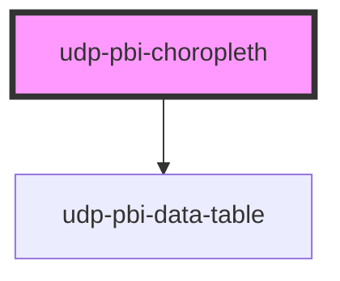

# udp-pbi-choropleth

<!-- Auto Generated Below -->

## Overview

Choropleth (FT "spatial"): regions coloured by a rate or a ratio. Never shade raw counts — larger
regions would win by size alone; a count belongs on a point map's bubbles or spikes. Classes are
equal intervals (`quantize`), equal counts (`quantile`) or a continuous 7-step ramp; `diverging`
colours around `colorCenter`, favourable side by `goodWhen`. `shape="tiles"` is an equal-area
cartogram (every region one tile, from `tileLayout`), `projection="globe"` an orthographic globe.
Regions the boundaries do not know are listed under the map, never dropped silently.

## Properties

| Property           | Attribute            | Description                                                                                     | Type                                                                                                          | Default           |
| ------------------ | -------------------- | ----------------------------------------------------------------------------------------------- | ------------------------------------------------------------------------------------------------------------- | ----------------- |
| `calc`             | `calc`               |                                                                                                 | `string \| undefined`                                                                                         | `undefined`       |
| `chartHeight`      | `chart-height`       |                                                                                                 | `number`                                                                                                      | `360`             |
| `classCount`       | `class-count`        | Number of classes (3–7).                                                                        | `number`                                                                                                      | `5`               |
| `classes`          | `classes`            |                                                                                                 | `"continuous" \| "quantile" \| "quantize"`                                                                    | `'quantize'`      |
| `colorCenter`      | `color-center`       | Diverging centre (target, average, zero).                                                       | `number`                                                                                                      | `0`               |
| `colorScale`       | `color-scale`        |                                                                                                 | `"diverging" \| "sequential"`                                                                                 | `'sequential'`    |
| `contextObject`    | `context-object`     | Topology object drawn as neighbouring context land.                                             | `string \| undefined`                                                                                         | `undefined`       |
| `crossFilterField` | `cross-filter-field` |                                                                                                 | `string \| undefined`                                                                                         | `undefined`       |
| `emptyMessage`     | `empty-message`      |                                                                                                 | `string \| undefined`                                                                                         | `undefined`       |
| `error`            | `error`              |                                                                                                 | `string \| undefined`                                                                                         | `undefined`       |
| `exportFileName`   | `export-file-name`   |                                                                                                 | `string \| undefined`                                                                                         | `undefined`       |
| `exportFormats`    | --                   |                                                                                                 | `ExportFormat[]`                                                                                              | `['csv', 'xlsx']` |
| `exportRows`       | --                   |                                                                                                 | `TableRow[] \| undefined`                                                                                     | `undefined`       |
| `exportable`       | `exportable`         |                                                                                                 | `boolean`                                                                                                     | `true`            |
| `featureKey`       | `feature-key`        | Feature property the region keys match (ISO code by default; postal codes and names match too). | `string`                                                                                                      | `'code'`          |
| `fit`              | `fit`                | `data`: frame the regions with values; `all`: every boundary.                                   | `"all" \| "data"`                                                                                             | `'data'`          |
| `focusable`        | `focusable`          |                                                                                                 | `boolean`                                                                                                     | `true`            |
| `format`           | --                   | Format of the values.                                                                           | `FormatSpec \| undefined`                                                                                     | `undefined`       |
| `frame`            | `frame`              |                                                                                                 | `"card" \| "none"`                                                                                            | `'card'`          |
| `geometry`         | --                   | The boundaries: a TopoJSON topology or a GeoJSON FeatureCollection (WGS 84).                    | `FeatureCollection<Geometry, GeoJsonProperties> \| Topology<Objects<GeoJsonProperties>> \| null \| undefined` | `undefined`       |
| `geometryObject`   | `geometry-object`    | Topology object holding the regions (default: the first).                                       | `string \| undefined`                                                                                         | `undefined`       |
| `goodWhen`         | `good-when`          |                                                                                                 | `"higher" \| "lower"`                                                                                         | `'higher'`        |
| `heading`          | `heading`            |                                                                                                 | `string`                                                                                                      | `''`              |
| `index`            | `index`              |                                                                                                 | `number`                                                                                                      | `0`               |
| `info`             | `info`               |                                                                                                 | `string \| undefined`                                                                                         | `undefined`       |
| `interactive`      | `interactive`        |                                                                                                 | `boolean \| undefined`                                                                                        | `undefined`       |
| `label`            | `label`              |                                                                                                 | `string \| undefined`                                                                                         | `undefined`       |
| `labels`           | `labels`             |                                                                                                 | `"auto" \| "none"`                                                                                            | `'auto'`          |
| `loading`          | `loading`            |                                                                                                 | `boolean`                                                                                                     | `false`           |
| `loadingRows`      | `loading-rows`       |                                                                                                 | `number`                                                                                                      | `5`               |
| `noDataLabel`      | `no-data-label`      |                                                                                                 | `string`                                                                                                      | `'No data'`       |
| `projection`       | `projection`         |                                                                                                 | `"auto" \| "conic" \| "equal-earth" \| "globe" \| "mercator"`                                                 | `'auto'`          |
| `regionLabel`      | `region-label`       |                                                                                                 | `string`                                                                                                      | `'Region'`        |
| `regions`          | --                   | One value per region.                                                                           | `RegionValue[]`                                                                                               | `[]`              |
| `selectedValue`    | `selected-value`     | The selected region (its raw value or key).                                                     | `boolean \| null \| number \| string \| undefined`                                                            | `undefined`       |
| `shape`            | `shape`              | `map`: the real shapes; `tiles`: an equal-area tile grid (`tileLayout`).                        | `"map" \| "tiles"`                                                                                            | `'map'`           |
| `stale`            | `stale`              |                                                                                                 | `boolean`                                                                                                     | `false`           |
| `subheading`       | `subheading`         |                                                                                                 | `string \| undefined`                                                                                         | `undefined`       |
| `tableToggle`      | `table-toggle`       |                                                                                                 | `boolean`                                                                                                     | `true`            |
| `testIdPrefix`     | `test-id-prefix`     | data-testid prefix: `${p}-region-${key}`.                                                       | `string \| undefined`                                                                                         | `undefined`       |
| `theme`            | `theme`              |                                                                                                 | `"neoglass" \| "nocturne" \| undefined`                                                                       | `undefined`       |
| `tileLayout`       | --                   | Tile grid: region code → [column, row].                                                         | `[number, number] \| string \| undefined`                                                                     | `undefined`       |
| `valueLabel`       | `value-label`        |                                                                                                 | `string`                                                                                                      | `'Value'`         |
| `visualId`         | `visual-id`          | Identifies the visual in its events.                                                            | `string \| undefined`                                                                                         | `undefined`       |
| `zoomable`         | `zoomable`           |                                                                                                 | `boolean`                                                                                                     | `true`            |

## Events

| Event             | Description | Type                                |
| ----------------- | ----------- | ----------------------------------- |
| `dataPointClick`  |             | `CustomEvent<DataPointClickDetail>` |
| `exportData`      |             | `CustomEvent<ExportDetail>`         |
| `focusModeChange` |             | `CustomEvent<FocusModeDetail>`      |
| `viewChange`      |             | `CustomEvent<ViewChangeDetail>`     |

## Dependencies

### Depends on

- [udp-pbi-data-table](../../tables/udp-pbi-data-table)

### Graph

----------------------------------------------

*Generated by Stencil from the component source. Do not edit by hand.*
