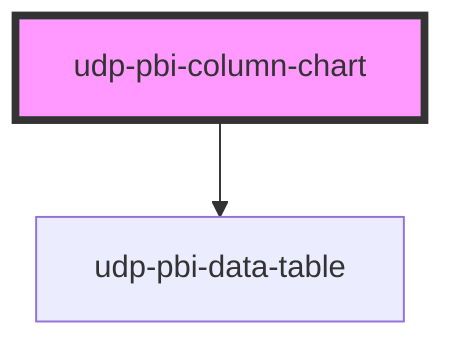

# udp-pbi-column-chart

<!-- Auto Generated Below -->

## Overview

Columns (FT "magnitude", "change over time", "distribution"): vertical bars for periods and ordinal
bands, single or by series (grouped, stacked, 100 %), or a histogram (no gaps between bins). Bars
start at zero, the grid stays quiet, totals sit on top when they fit, and reference lines mark a
target or average. Hover or the arrow keys show a tooltip with every series and the extra
`tooltips` measures; a click (Enter / Space) reports the category and, on a segment, its series.

## Properties

| Property           | Attribute            | Description                                                                                                                                                                             | Type                                               | Default           |
| ------------------ | -------------------- | --------------------------------------------------------------------------------------------------------------------------------------------------------------------------------------- | -------------------------------------------------- | ----------------- |
| `calc`             | `calc`               | Curtain: how it is calculated, one line.                                                                                                                                                | `string \| undefined`                              | `undefined`       |
| `categories`       | --                   | Categories in display order (periods, bands, names).                                                                                                                                    | `ChartCategory[]`                                  | `[]`              |
| `categoryLabel`    | `category-label`     | Header of the category column in the table view and the export.                                                                                                                         | `string`                                           | `'Category'`      |
| `chartHeight`      | `chart-height`       | Plot height in px.                                                                                                                                                                      | `number`                                           | `260`             |
| `crossFilterField` | `cross-filter-field` | Column reference a click on a category filters, e.g. 'Date'[Year].                                                                                                                      | `string \| undefined`                              | `undefined`       |
| `emptyMessage`     | `empty-message`      |                                                                                                                                                                                         | `string \| undefined`                              | `undefined`       |
| `error`            | `error`              |                                                                                                                                                                                         | `string \| undefined`                              | `undefined`       |
| `exportFileName`   | `export-file-name`   |                                                                                                                                                                                         | `string \| undefined`                              | `undefined`       |
| `exportFormats`    | --                   |                                                                                                                                                                                         | `ExportFormat[]`                                   | `['csv', 'xlsx']` |
| `exportRows`       | --                   | Raw query rows to export instead of the visual's table.                                                                                                                                 | `TableRow[] \| undefined`                          | `undefined`       |
| `exportable`       | `exportable`         |                                                                                                                                                                                         | `boolean`                                          | `true`            |
| `focusable`        | `focusable`          |                                                                                                                                                                                         | `boolean`                                          | `true`            |
| `format`           | --                   |                                                                                                                                                                                         | `FormatSpec \| undefined`                          | `undefined`       |
| `frame`            | `frame`              | card: the Univerus template card (header, toolbar, curtain, focus view). none: the visual alone, to compose inside a host card (UDP: udp-fluent-card); states and events are unchanged. | `"card" \| "none"`                                 | `'card'`          |
| `heading`          | `heading`            | Card title (`title` is a global HTML attribute, hence `heading`).                                                                                                                       | `string`                                           | `''`              |
| `index`            | `index`              | Entrance stagger position.                                                                                                                                                              | `number`                                           | `0`               |
| `info`             | `info`               | Curtain: what the chart means, one sentence.                                                                                                                                            | `string \| undefined`                              | `undefined`       |
| `interactive`      | `interactive`        | A click emits `dataPointClick` (default: when a field is set).                                                                                                                          | `boolean \| undefined`                             | `undefined`       |
| `label`            | `label`              | Accessible name of the chart; defaults to the heading.                                                                                                                                  | `string \| undefined`                              | `undefined`       |
| `labels`           | `labels`             | auto: totals (or shares, at 100 %) where they fit; none: tooltip and table only.                                                                                                        | `"auto" \| "none"`                                 | `'auto'`          |
| `layout`           | `layout`             | Several series: side by side, stacked, or stacked to 100 %.                                                                                                                             | `"grouped" \| "percent" \| "stacked"`              | `'stacked'`       |
| `loading`          | `loading`            |                                                                                                                                                                                         | `boolean`                                          | `false`           |
| `loadingRows`      | `loading-rows`       |                                                                                                                                                                                         | `number`                                           | `5`               |
| `palette`          | `palette`            | Nominal series (categorical), ordered grades (sequential) or bad ↔ good (diverging).                                                                                                    | `"categorical" \| "diverging" \| "sequential"`     | `'categorical'`   |
| `referenceLines`   | --                   |                                                                                                                                                                                         | `ReferenceLineSpec[]`                              | `[]`              |
| `selectedSeries`   | `selected-series`    | The selected series (raw value or id): other series dim.                                                                                                                                | `boolean \| null \| number \| string \| undefined` | `undefined`       |
| `selectedValue`    | `selected-value`     | The selected category (its raw value or id): the others dim.                                                                                                                            | `boolean \| null \| number \| string \| undefined` | `undefined`       |
| `series`           | --                   | One series (single columns) or several, each with one value per category.                                                                                                               | `ChartSeries[]`                                    | `[]`              |
| `seriesField`      | `series-field`       | Column reference of the series dimension: a click on a segment also filters it.                                                                                                         | `string \| undefined`                              | `undefined`       |
| `sort`             | `sort`               | none keeps the order received (time, ordinal bands).                                                                                                                                    | `"asc" \| "desc" \| "none"`                        | `'none'`          |
| `stale`            | `stale`              | Previous filters' data shown (dimmed) while the new query runs.                                                                                                                         | `boolean`                                          | `false`           |
| `subheading`       | `subheading`         |                                                                                                                                                                                         | `string \| undefined`                              | `undefined`       |
| `tableToggle`      | `table-toggle`       |                                                                                                                                                                                         | `boolean`                                          | `true`            |
| `testIdPrefix`     | `test-id-prefix`     |                                                                                                                                                                                         | `string \| undefined`                              | `undefined`       |
| `theme`            | `theme`              | Pins this element to a template regardless of <html data-theme>.                                                                                                                        | `"neoglass" \| "nocturne" \| undefined`            | `undefined`       |
| `topN`             | `top-n`              | Keep the N largest categories; the rest fold into "Other".                                                                                                                              | `number \| undefined`                              | `undefined`       |
| `variant`          | `variant`            | histogram: bins touch (a distribution, not separate categories).                                                                                                                        | `"column" \| "histogram"`                          | `'column'`        |
| `visualId`         | `visual-id`          | Identifies the visual in its events.                                                                                                                                                    | `string \| undefined`                              | `undefined`       |

## Events

| Event             | Description | Type                                |
| ----------------- | ----------- | ----------------------------------- |
| `dataPointClick`  |             | `CustomEvent<DataPointClickDetail>` |
| `exportData`      |             | `CustomEvent<ExportDetail>`         |
| `focusModeChange` |             | `CustomEvent<FocusModeDetail>`      |
| `viewChange`      |             | `CustomEvent<ViewChangeDetail>`     |

## Dependencies

### Depends on

- [udp-pbi-data-table](../../tables/udp-pbi-data-table)

### Graph

----------------------------------------------

*Generated by Stencil from the component source. Do not edit by hand.*
