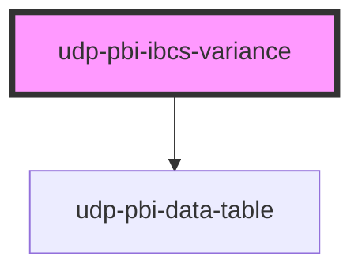

# udp-pbi-ibcs-variance

<!-- Auto Generated Below -->

## Overview

IBCS variance chart (port of Lens `ibcs_variance`): AC vs comparison, ΔAbs bars and Δ% pins,
aligned per category. One unit (K / M / bn) for every label, stated in the panel titles.
Hover highlights a row / column; a click selects it (cross-filter), dimming the others.

## Properties

| Property           | Attribute            | Description                                                                                                                                                                             | Type                                               | Default           |
| ------------------ | -------------------- | --------------------------------------------------------------------------------------------------------------------------------------------------------------------------------------- | -------------------------------------------------- | ----------------- |
| `actualLabel`      | `actual-label`       |                                                                                                                                                                                         | `string`                                           | `'AC'`            |
| `calc`             | `calc`               | Curtain: how it is calculated, one line.                                                                                                                                                | `string \| undefined`                              | `undefined`       |
| `chartHeight`      | `chart-height`       | Vertical orientation only: plot height in px.                                                                                                                                           | `number`                                           | `420`             |
| `comparisonLabel`  | `comparison-label`   | Default: the scenario code.                                                                                                                                                             | `string \| undefined`                              | `undefined`       |
| `crossFilterField` | `cross-filter-field` | Column reference a click filters.                                                                                                                                                       | `string \| undefined`                              | `undefined`       |
| `data`             | --                   | Categories with actual and comparison values.                                                                                                                                           | `IbcsItem[]`                                       | `[]`              |
| `decimals`         | `decimals`           |                                                                                                                                                                                         | `number`                                           | `1`               |
| `emptyMessage`     | `empty-message`      |                                                                                                                                                                                         | `string \| undefined`                              | `undefined`       |
| `error`            | `error`              |                                                                                                                                                                                         | `string \| undefined`                              | `undefined`       |
| `exportFileName`   | `export-file-name`   |                                                                                                                                                                                         | `string \| undefined`                              | `undefined`       |
| `exportFormats`    | --                   |                                                                                                                                                                                         | `ExportFormat[]`                                   | `['csv', 'xlsx']` |
| `exportRows`       | --                   | Raw query rows to export instead of the visual's table.                                                                                                                                 | `TableRow[] \| undefined`                          | `undefined`       |
| `exportable`       | `exportable`         |                                                                                                                                                                                         | `boolean`                                          | `true`            |
| `focusable`        | `focusable`          |                                                                                                                                                                                         | `boolean`                                          | `true`            |
| `format`           | --                   | Format of the table view and the export (the chart picks one unit, K / M / bn, for every label).                                                                                        | `FormatSpec \| undefined`                          | `undefined`       |
| `frame`            | `frame`              | card: the Univerus template card (header, toolbar, curtain, focus view). none: the visual alone, to compose inside a host card (UDP: udp-fluent-card); states and events are unchanged. | `"card" \| "none"`                                 | `'card'`          |
| `goodWhen`         | `good-when`          | `higher` for revenue / availability, `lower` for cost / backlog: colour follows business meaning.                                                                                       | `"higher" \| "lower"`                              | `'higher'`        |
| `heading`          | `heading`            | Card title (`title` is a global HTML attribute, hence `heading`).                                                                                                                       | `string`                                           | `''`              |
| `index`            | `index`              | Entrance stagger position.                                                                                                                                                              | `number`                                           | `0`               |
| `info`             | `info`               | Curtain: what the chart means, one sentence.                                                                                                                                            | `string \| undefined`                              | `undefined`       |
| `interactive`      | `interactive`        | A click on a row / column emits `dataPointClick` (default: when `crossFilterField` is set).                                                                                             | `boolean \| undefined`                             | `undefined`       |
| `label`            | `label`              | Accessible name of the chart; defaults to the heading.                                                                                                                                  | `string \| undefined`                              | `undefined`       |
| `loading`          | `loading`            |                                                                                                                                                                                         | `boolean`                                          | `false`           |
| `loadingRows`      | `loading-rows`       |                                                                                                                                                                                         | `number`                                           | `6`               |
| `orientation`      | `orientation`        | horizontal: structures (regions, classes, accounts) down the page; vertical: time left to right.                                                                                        | `"horizontal" \| "vertical"`                       | `'horizontal'`    |
| `pctCap`           | `pct-cap`            | Δ% axis limit (2 = ±200 %); outliers are drawn at the cap as a triangle with their real label.                                                                                          | `number`                                           | `2`               |
| `scenario`         | `scenario`           | IBCS notation of the comparison: PY solid grey · PL outlined · FC dashed · BU dotted.                                                                                                   | `"BU" \| "FC" \| "PL" \| "PY"`                     | `'PY'`            |
| `selectedValue`    | `selected-value`     | The selected category's value; the other rows dim.                                                                                                                                      | `boolean \| null \| number \| string \| undefined` | `undefined`       |
| `sort`             | `sort`               | Default: `actual` for horizontal, `natural` for vertical.                                                                                                                               | `"actual" \| "natural" \| "variance" \| undefined` | `undefined`       |
| `stale`            | `stale`              | Previous filters' data shown (dimmed) while the new query runs.                                                                                                                         | `boolean`                                          | `false`           |
| `subheading`       | `subheading`         |                                                                                                                                                                                         | `string \| undefined`                              | `undefined`       |
| `tableToggle`      | `table-toggle`       |                                                                                                                                                                                         | `boolean`                                          | `true`            |
| `testIdPrefix`     | `test-id-prefix`     |                                                                                                                                                                                         | `string \| undefined`                              | `undefined`       |
| `theme`            | `theme`              | Pins this element to a template regardless of <html data-theme>.                                                                                                                        | `"neoglass" \| "nocturne" \| undefined`            | `undefined`       |
| `topN`             | `top-n`              |                                                                                                                                                                                         | `number`                                           | `0`               |
| `visualId`         | `visual-id`          | Identifies the visual in its events.                                                                                                                                                    | `string \| undefined`                              | `undefined`       |

## Events

| Event             | Description | Type                                |
| ----------------- | ----------- | ----------------------------------- |
| `dataPointClick`  |             | `CustomEvent<DataPointClickDetail>` |
| `exportData`      |             | `CustomEvent<ExportDetail>`         |
| `focusModeChange` |             | `CustomEvent<FocusModeDetail>`      |
| `viewChange`      |             | `CustomEvent<ViewChangeDetail>`     |

## Dependencies

### Depends on

- [udp-pbi-data-table](../../tables/udp-pbi-data-table)

### Graph

----------------------------------------------

*Generated by Stencil from the component source. Do not edit by hand.*
