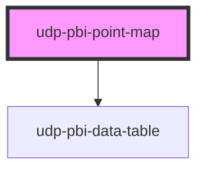

# udp-pbi-point-map

<!-- Auto Generated Below -->

## Overview

Point map (FT "spatial"): locations at their exact coordinates (WGS 84 latitude / longitude).
`dot` places them (colour by group), `bubble` and `spike` size them by value (area ∝ value; a
spike's height ∝ value, the 2.5D variant), `hexbin` and `heat` show density where points crowd.
`projection="globe"` draws an orthographic globe you rotate by dragging, or by moving between
locations with the arrow keys. Boundaries are context only (`geometry`, from the host); an
optional raster basemap comes from the host too (`tiles`, Web Mercator). Zoom with the buttons,
Ctrl + wheel or a pinch; the page keeps its scroll. A click (Enter / Space) reports the location.

## Properties

| Property           | Attribute            | Description                                                                                 | Type                                                                                                          | Default           |
| ------------------ | -------------------- | ------------------------------------------------------------------------------------------- | ------------------------------------------------------------------------------------------------------------- | ----------------- |
| `calc`             | `calc`               |                                                                                             | `string \| undefined`                                                                                         | `undefined`       |
| `categoryLabel`    | `category-label`     |                                                                                             | `string`                                                                                                      | `'Location'`      |
| `chartHeight`      | `chart-height`       |                                                                                             | `number`                                                                                                      | `360`             |
| `contextObject`    | `context-object`     | Topology object drawn as neighbouring context land.                                         | `string \| undefined`                                                                                         | `undefined`       |
| `crossFilterField` | `cross-filter-field` | Column a click filters (reported in `dataPointClick`).                                      | `string \| undefined`                                                                                         | `undefined`       |
| `emptyMessage`     | `empty-message`      |                                                                                             | `string \| undefined`                                                                                         | `undefined`       |
| `error`            | `error`              |                                                                                             | `string \| undefined`                                                                                         | `undefined`       |
| `exportFileName`   | `export-file-name`   |                                                                                             | `string \| undefined`                                                                                         | `undefined`       |
| `exportFormats`    | --                   |                                                                                             | `ExportFormat[]`                                                                                              | `['csv', 'xlsx']` |
| `exportRows`       | --                   |                                                                                             | `TableRow[] \| undefined`                                                                                     | `undefined`       |
| `exportable`       | `exportable`         |                                                                                             | `boolean`                                                                                                     | `true`            |
| `focusable`        | `focusable`          |                                                                                             | `boolean`                                                                                                     | `true`            |
| `format`           | --                   | Format of the values.                                                                       | `FormatSpec \| undefined`                                                                                     | `undefined`       |
| `frame`            | `frame`              | `card` (default): the template card; `none`: the map alone, for a host card.                | `"card" \| "none"`                                                                                            | `'card'`          |
| `geometry`         | --                   | Context boundaries: a TopoJSON topology or a GeoJSON FeatureCollection (WGS 84).            | `FeatureCollection<Geometry, GeoJsonProperties> \| Topology<Objects<GeoJsonProperties>> \| null \| undefined` | `undefined`       |
| `geometryObject`   | `geometry-object`    | Topology object drawn as land (default: the first).                                         | `string \| undefined`                                                                                         | `undefined`       |
| `groupLabel`       | `group-label`        |                                                                                             | `string`                                                                                                      | `'Group'`         |
| `heading`          | `heading`            | Card title.                                                                                 | `string`                                                                                                      | `''`              |
| `index`            | `index`              |                                                                                             | `number`                                                                                                      | `0`               |
| `info`             | `info`               |                                                                                             | `string \| undefined`                                                                                         | `undefined`       |
| `interactive`      | `interactive`        |                                                                                             | `boolean \| undefined`                                                                                        | `undefined`       |
| `label`            | `label`              | Accessible name of the map (default: heading).                                              | `string \| undefined`                                                                                         | `undefined`       |
| `loading`          | `loading`            |                                                                                             | `boolean`                                                                                                     | `false`           |
| `loadingRows`      | `loading-rows`       |                                                                                             | `number`                                                                                                      | `5`               |
| `mark`             | `mark`               |                                                                                             | `"bubble" \| "dot" \| "heat" \| "hexbin" \| "spike"`                                                          | `'dot'`           |
| `points`           | --                   | The located points.                                                                         | `GeoPoint[]`                                                                                                  | `[]`              |
| `projection`       | `projection`         | `auto` picks by extent (Mercator → conic → Equal Earth); `globe` is an orthographic sphere. | `"auto" \| "conic" \| "equal-earth" \| "globe" \| "mercator"`                                                 | `'auto'`          |
| `selectedValue`    | `selected-value`     | The selected location (its raw value or id).                                                | `boolean \| null \| number \| string \| undefined`                                                            | `undefined`       |
| `stale`            | `stale`              |                                                                                             | `boolean`                                                                                                     | `false`           |
| `subheading`       | `subheading`         |                                                                                             | `string \| undefined`                                                                                         | `undefined`       |
| `tableToggle`      | `table-toggle`       |                                                                                             | `boolean`                                                                                                     | `true`            |
| `testIdPrefix`     | `test-id-prefix`     | data-testid prefix: `${p}-point-${id}`.                                                     | `string \| undefined`                                                                                         | `undefined`       |
| `theme`            | `theme`              |                                                                                             | `"neoglass" \| "nocturne" \| undefined`                                                                       | `undefined`       |
| `tiles`            | --                   | Raster basemap from the host (Web Mercator; forces a Mercator projection).                  | `MapTiles \| undefined`                                                                                       | `undefined`       |
| `valueLabel`       | `value-label`        |                                                                                             | `string`                                                                                                      | `'Value'`         |
| `visualId`         | `visual-id`          | Identifies the visual in its events.                                                        | `string \| undefined`                                                                                         | `undefined`       |
| `zoomable`         | `zoomable`           | Zoom buttons, Ctrl + wheel and pinch.                                                       | `boolean`                                                                                                     | `true`            |

## Events

| Event             | Description | Type                                |
| ----------------- | ----------- | ----------------------------------- |
| `dataPointClick`  |             | `CustomEvent<DataPointClickDetail>` |
| `exportData`      |             | `CustomEvent<ExportDetail>`         |
| `focusModeChange` |             | `CustomEvent<FocusModeDetail>`      |
| `viewChange`      |             | `CustomEvent<ViewChangeDetail>`     |

## Dependencies

### Depends on

- [udp-pbi-data-table](../../tables/udp-pbi-data-table)

### Graph

----------------------------------------------

*Generated by Stencil from the component source. Do not edit by hand.*
