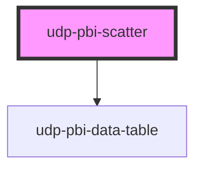

# udp-pbi-scatter

<!-- Auto Generated Below -->

## Overview

Scatter / bubble (FT "correlation"): how two measures relate across categories, optionally with
a third as the bubble's area and a group as its colour. Reference lines on x and y split the
plot into labelled quadrants (e.g. "high criticality, poor condition"). The selected point and
the top N are labelled directly. Hover, or the arrow keys (points in x order), show the tooltip;
a click (Enter / Space) reports the point's category.

## Properties

| Property           | Attribute            | Description                                                                                                                                                                             | Type                                               | Default           |
| ------------------ | -------------------- | --------------------------------------------------------------------------------------------------------------------------------------------------------------------------------------- | -------------------------------------------------- | ----------------- |
| `calc`             | `calc`               | Curtain: how it is calculated, one line.                                                                                                                                                | `string \| undefined`                              | `undefined`       |
| `categoryLabel`    | `category-label`     | Header of the category column in the table view and the export.                                                                                                                         | `string`                                           | `'Category'`      |
| `chartHeight`      | `chart-height`       | Plot height in px.                                                                                                                                                                      | `number`                                           | `300`             |
| `crossFilterField` | `cross-filter-field` | Column reference a click filters.                                                                                                                                                       | `string \| undefined`                              | `undefined`       |
| `emptyMessage`     | `empty-message`      |                                                                                                                                                                                         | `string \| undefined`                              | `undefined`       |
| `error`            | `error`              |                                                                                                                                                                                         | `string \| undefined`                              | `undefined`       |
| `exportFileName`   | `export-file-name`   |                                                                                                                                                                                         | `string \| undefined`                              | `undefined`       |
| `exportFormats`    | --                   |                                                                                                                                                                                         | `ExportFormat[]`                                   | `['csv', 'xlsx']` |
| `exportRows`       | --                   | Raw query rows to export instead of the visual's table.                                                                                                                                 | `TableRow[] \| undefined`                          | `undefined`       |
| `exportable`       | `exportable`         |                                                                                                                                                                                         | `boolean`                                          | `true`            |
| `focusable`        | `focusable`          |                                                                                                                                                                                         | `boolean`                                          | `true`            |
| `format`           | --                   | Format of the y values (and the default for x).                                                                                                                                         | `FormatSpec \| undefined`                          | `undefined`       |
| `frame`            | `frame`              | card: the Univerus template card (header, toolbar, curtain, focus view). none: the visual alone, to compose inside a host card (UDP: udp-fluent-card); states and events are unchanged. | `"card" \| "none"`                                 | `'card'`          |
| `heading`          | `heading`            | Card title (`title` is a global HTML attribute, hence `heading`).                                                                                                                       | `string`                                           | `''`              |
| `index`            | `index`              | Entrance stagger position.                                                                                                                                                              | `number`                                           | `0`               |
| `info`             | `info`               | Curtain: what the chart means, one sentence.                                                                                                                                            | `string \| undefined`                              | `undefined`       |
| `interactive`      | `interactive`        | A click emits `dataPointClick` (default: when `crossFilterField` is set).                                                                                                               | `boolean \| undefined`                             | `undefined`       |
| `label`            | `label`              | Accessible name of the chart; defaults to the heading.                                                                                                                                  | `string \| undefined`                              | `undefined`       |
| `labelTop`         | `label-top`          | Label the N largest points (by size, else y) directly.                                                                                                                                  | `number`                                           | `5`               |
| `loading`          | `loading`            |                                                                                                                                                                                         | `boolean`                                          | `false`           |
| `loadingRows`      | `loading-rows`       |                                                                                                                                                                                         | `number`                                           | `5`               |
| `points`           | --                   |                                                                                                                                                                                         | `ScatterPoint[]`                                   | `[]`              |
| `quadrantLabels`   | --                   | Quadrant captions when both references are set: [top-left, top-right, bottom-left, bottom-right].                                                                                       | `string[] \| undefined`                            | `undefined`       |
| `selectedValue`    | `selected-value`     | The selected point (its raw value or id): labelled and ringed, the others dim.                                                                                                          | `boolean \| null \| number \| string \| undefined` | `undefined`       |
| `sizeFormat`       | --                   |                                                                                                                                                                                         | `FormatSpec \| undefined`                          | `undefined`       |
| `sizeLabel`        | `size-label`         | What the bubble size measures (omit when there is no size).                                                                                                                             | `string \| undefined`                              | `undefined`       |
| `stale`            | `stale`              | Previous filters' data shown (dimmed) while the new query runs.                                                                                                                         | `boolean`                                          | `false`           |
| `subheading`       | `subheading`         |                                                                                                                                                                                         | `string \| undefined`                              | `undefined`       |
| `tableToggle`      | `table-toggle`       |                                                                                                                                                                                         | `boolean`                                          | `true`            |
| `testIdPrefix`     | `test-id-prefix`     |                                                                                                                                                                                         | `string \| undefined`                              | `undefined`       |
| `theme`            | `theme`              | Pins this element to a template regardless of <html data-theme>.                                                                                                                        | `"neoglass" \| "nocturne" \| undefined`            | `undefined`       |
| `visualId`         | `visual-id`          | Identifies the visual in its events.                                                                                                                                                    | `string \| undefined`                              | `undefined`       |
| `xFormat`          | --                   |                                                                                                                                                                                         | `FormatSpec \| undefined`                          | `undefined`       |
| `xLabel`           | `x-label`            | What x and y measure (axis captions, tooltip and table).                                                                                                                                | `string`                                           | `'x'`             |
| `xReference`       | --                   | Vertical reference line at an x value (target, average).                                                                                                                                | `ReferenceLineSpec \| undefined`                   | `undefined`       |
| `xZero`            | `x-zero`             | Start an axis at zero.                                                                                                                                                                  | `boolean`                                          | `false`           |
| `yLabel`           | `y-label`            |                                                                                                                                                                                         | `string`                                           | `'y'`             |
| `yReference`       | --                   | Horizontal reference line at a y value.                                                                                                                                                 | `ReferenceLineSpec \| undefined`                   | `undefined`       |
| `yZero`            | `y-zero`             |                                                                                                                                                                                         | `boolean`                                          | `false`           |

## Events

| Event             | Description | Type                                |
| ----------------- | ----------- | ----------------------------------- |
| `dataPointClick`  |             | `CustomEvent<DataPointClickDetail>` |
| `exportData`      |             | `CustomEvent<ExportDetail>`         |
| `focusModeChange` |             | `CustomEvent<FocusModeDetail>`      |
| `viewChange`      |             | `CustomEvent<ViewChangeDetail>`     |

## Dependencies

### Depends on

- [udp-pbi-data-table](../../tables/udp-pbi-data-table)

### Graph

----------------------------------------------

*Generated by Stencil from the component source. Do not edit by hand.*
