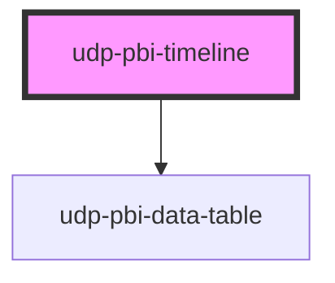

# udp-pbi-timeline

<!-- Auto Generated Below -->

## Overview

Timeline (Priestley / Gantt; FT "change over time"): items with a start and an end — warranties,
contracts, projects — on a time axis, grouped in lanes and packed so overlapping items never
collide; "today" is a line, so what runs and what ends soon read at once. Each bar is a thin rule
coloured by meaning (`tone`: ok / warn / bad), its name above it. Hover or ↑ ↓ (items by start)
show the dates; a click (Enter / Space) reports the item.

## Properties

| Property           | Attribute            | Description                                                                                                                                                                             | Type                                                         | Default           |
| ------------------ | -------------------- | --------------------------------------------------------------------------------------------------------------------------------------------------------------------------------------- | ------------------------------------------------------------ | ----------------- |
| `calc`             | `calc`               | Curtain: how it is calculated, one line.                                                                                                                                                | `string \| undefined`                                        | `undefined`       |
| `categoryLabel`    | `category-label`     | Header of the item and lane columns in the table view and the export.                                                                                                                   | `string`                                                     | `'Item'`          |
| `crossFilterField` | `cross-filter-field` | Column reference a click filters.                                                                                                                                                       | `string \| undefined`                                        | `undefined`       |
| `emptyMessage`     | `empty-message`      |                                                                                                                                                                                         | `string \| undefined`                                        | `undefined`       |
| `error`            | `error`              |                                                                                                                                                                                         | `string \| undefined`                                        | `undefined`       |
| `exportFileName`   | `export-file-name`   |                                                                                                                                                                                         | `string \| undefined`                                        | `undefined`       |
| `exportFormats`    | --                   |                                                                                                                                                                                         | `ExportFormat[]`                                             | `['csv', 'xlsx']` |
| `exportRows`       | --                   | Raw query rows to export instead of the visual's table.                                                                                                                                 | `TableRow[] \| undefined`                                    | `undefined`       |
| `exportable`       | `exportable`         |                                                                                                                                                                                         | `boolean`                                                    | `true`            |
| `focusable`        | `focusable`          |                                                                                                                                                                                         | `boolean`                                                    | `true`            |
| `format`           | --                   | Not used for dates; kept for the shared contract (tooltip measures carry their own).                                                                                                    | `FormatSpec \| undefined`                                    | `undefined`       |
| `frame`            | `frame`              | card: the Univerus template card (header, toolbar, curtain, focus view). none: the visual alone, to compose inside a host card (UDP: udp-fluent-card); states and events are unchanged. | `"card" \| "none"`                                           | `'card'`          |
| `heading`          | `heading`            | Card title (`title` is a global HTML attribute, hence `heading`).                                                                                                                       | `string`                                                     | `''`              |
| `index`            | `index`              | Entrance stagger position.                                                                                                                                                              | `number`                                                     | `0`               |
| `info`             | `info`               | Curtain: what the chart means, one sentence.                                                                                                                                            | `string \| undefined`                                        | `undefined`       |
| `interactive`      | `interactive`        | A click emits `dataPointClick` (default: when `crossFilterField` is set).                                                                                                               | `boolean \| undefined`                                       | `undefined`       |
| `label`            | `label`              | Accessible name of the chart; defaults to the heading.                                                                                                                                  | `string \| undefined`                                        | `undefined`       |
| `laneLabel`        | `lane-label`         |                                                                                                                                                                                         | `string`                                                     | `'Lane'`          |
| `loading`          | `loading`            |                                                                                                                                                                                         | `boolean`                                                    | `false`           |
| `loadingRows`      | `loading-rows`       |                                                                                                                                                                                         | `number`                                                     | `5`               |
| `selectedValue`    | `selected-value`     | The selected item (raw value or id): the others dim.                                                                                                                                    | `boolean \| null \| number \| string \| undefined`           | `undefined`       |
| `stale`            | `stale`              | Previous filters' data shown (dimmed) while the new query runs.                                                                                                                         | `boolean`                                                    | `false`           |
| `subheading`       | `subheading`         |                                                                                                                                                                                         | `string \| undefined`                                        | `undefined`       |
| `tableToggle`      | `table-toggle`       |                                                                                                                                                                                         | `boolean`                                                    | `true`            |
| `tasks`            | --                   |                                                                                                                                                                                         | `TimelineTask[]`                                             | `[]`              |
| `testIdPrefix`     | `test-id-prefix`     |                                                                                                                                                                                         | `string \| undefined`                                        | `undefined`       |
| `theme`            | `theme`              | Pins this element to a template regardless of <html data-theme>.                                                                                                                        | `"neoglass" \| "nocturne" \| undefined`                      | `undefined`       |
| `today`            | `today`              | The "today" line: an ISO date, `auto` (the current day) or `none`.                                                                                                                      | `string`                                                     | `'auto'`          |
| `toneLabels`       | --                   | Legend text per tone, e.g. { ok: 'Active', warn: 'Ends within 90 days', bad: 'Expired' }.                                                                                               | `"accent" \| "bad" \| "neutral" \| "ok" \| "warn" \| string` | `{}`              |
| `visualId`         | `visual-id`          | Identifies the visual in its events.                                                                                                                                                    | `string \| undefined`                                        | `undefined`       |

## Events

| Event             | Description | Type                                |
| ----------------- | ----------- | ----------------------------------- |
| `dataPointClick`  |             | `CustomEvent<DataPointClickDetail>` |
| `exportData`      |             | `CustomEvent<ExportDetail>`         |
| `focusModeChange` |             | `CustomEvent<FocusModeDetail>`      |
| `viewChange`      |             | `CustomEvent<ViewChangeDetail>`     |

## Dependencies

### Depends on

- [udp-pbi-data-table](../../tables/udp-pbi-data-table)

### Graph

----------------------------------------------

*Generated by Stencil from the component source. Do not edit by hand.*
