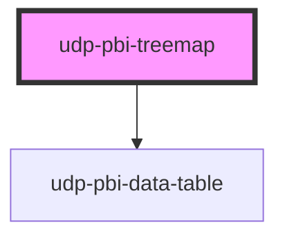

# udp-pbi-treemap

<!-- Auto Generated Below -->

## Overview

Treemap (FT "part-to-whole", hierarchical): how a total splits into nested parts — area is the
quantity, one or two levels (group → item). Squarified tiles, group headers, labels where they
fit; colour is a second measure on a token ramp (sequential, or diverging by meaning) or, without
one, a tonal step per group. The alternative to a donut beyond six parts. Hover or the arrow keys
show the tooltip (path, value, share); a click (Enter / Space) on an item reports its group and
item, on a header its group.

## Properties

| Property           | Attribute            | Description                                                                                                                                                                             | Type                                               | Default           |
| ------------------ | -------------------- | --------------------------------------------------------------------------------------------------------------------------------------------------------------------------------------- | -------------------------------------------------- | ----------------- |
| `calc`             | `calc`               | Curtain: how it is calculated, one line.                                                                                                                                                | `string \| undefined`                              | `undefined`       |
| `chartHeight`      | `chart-height`       | Plot height in px.                                                                                                                                                                      | `number`                                           | `320`             |
| `colorCenter`      | `color-center`       | diverging: the reference value.                                                                                                                                                         | `number`                                           | `0`               |
| `colorFormat`      | --                   |                                                                                                                                                                                         | `FormatSpec \| undefined`                          | `undefined`       |
| `colorLabel`       | `color-label`        | What the colour measures (tooltip, legend, table) when items carry `colorValue`.                                                                                                        | `string \| undefined`                              | `undefined`       |
| `colorScale`       | `color-scale`        | The colour ramp: sequential (low → high) or diverging around `colorCenter`.                                                                                                             | `"diverging" \| "sequential"`                      | `'sequential'`    |
| `crossFilterField` | `cross-filter-field` | Column reference of the top level (shorthand for `levelFields[0]`).                                                                                                                     | `string \| undefined`                              | `undefined`       |
| `emptyMessage`     | `empty-message`      |                                                                                                                                                                                         | `string \| undefined`                              | `undefined`       |
| `error`            | `error`              |                                                                                                                                                                                         | `string \| undefined`                              | `undefined`       |
| `exportFileName`   | `export-file-name`   |                                                                                                                                                                                         | `string \| undefined`                              | `undefined`       |
| `exportFormats`    | --                   |                                                                                                                                                                                         | `ExportFormat[]`                                   | `['csv', 'xlsx']` |
| `exportRows`       | --                   | Raw query rows to export instead of the visual's table.                                                                                                                                 | `TableRow[] \| undefined`                          | `undefined`       |
| `exportable`       | `exportable`         |                                                                                                                                                                                         | `boolean`                                          | `true`            |
| `focusable`        | `focusable`          |                                                                                                                                                                                         | `boolean`                                          | `true`            |
| `format`           | --                   | Format of the sizes.                                                                                                                                                                    | `FormatSpec \| undefined`                          | `undefined`       |
| `frame`            | `frame`              | card: the Univerus template card (header, toolbar, curtain, focus view). none: the visual alone, to compose inside a host card (UDP: udp-fluent-card); states and events are unchanged. | `"card" \| "none"`                                 | `'card'`          |
| `goodWhen`         | `good-when`          | diverging: the favourable side.                                                                                                                                                         | `"higher" \| "lower"`                              | `'higher'`        |
| `heading`          | `heading`            | Card title (`title` is a global HTML attribute, hence `heading`).                                                                                                                       | `string`                                           | `''`              |
| `index`            | `index`              | Entrance stagger position.                                                                                                                                                              | `number`                                           | `0`               |
| `info`             | `info`               | Curtain: what the chart means, one sentence.                                                                                                                                            | `string \| undefined`                              | `undefined`       |
| `interactive`      | `interactive`        | Clicks emit `dataPointClick` (default: when a field is set).                                                                                                                            | `boolean \| undefined`                             | `undefined`       |
| `label`            | `label`              | Accessible name of the chart; defaults to the heading.                                                                                                                                  | `string \| undefined`                              | `undefined`       |
| `levelFields`      | --                   | Column reference per level, top first: a click filters each level it belongs to.                                                                                                        | `string[]`                                         | `[]`              |
| `levelLabels`      | --                   | Headers of the levels in the table view and the export, top first.                                                                                                                      | `string[]`                                         | `[]`              |
| `loading`          | `loading`            |                                                                                                                                                                                         | `boolean`                                          | `false`           |
| `loadingRows`      | `loading-rows`       |                                                                                                                                                                                         | `number`                                           | `5`               |
| `nodes`            | --                   | Top-level parts, each optionally with `children` (two levels at most).                                                                                                                  | `TreemapNode[]`                                    | `[]`              |
| `selectedValue`    | `selected-value`     | The selected item or group (raw value or id): the others dim.                                                                                                                           | `boolean \| null \| number \| string \| undefined` | `undefined`       |
| `stale`            | `stale`              | Previous filters' data shown (dimmed) while the new query runs.                                                                                                                         | `boolean`                                          | `false`           |
| `subheading`       | `subheading`         |                                                                                                                                                                                         | `string \| undefined`                              | `undefined`       |
| `tableToggle`      | `table-toggle`       |                                                                                                                                                                                         | `boolean`                                          | `true`            |
| `testIdPrefix`     | `test-id-prefix`     |                                                                                                                                                                                         | `string \| undefined`                              | `undefined`       |
| `theme`            | `theme`              | Pins this element to a template regardless of <html data-theme>.                                                                                                                        | `"neoglass" \| "nocturne" \| undefined`            | `undefined`       |
| `visualId`         | `visual-id`          | Identifies the visual in its events.                                                                                                                                                    | `string \| undefined`                              | `undefined`       |

## Events

| Event             | Description | Type                                |
| ----------------- | ----------- | ----------------------------------- |
| `dataPointClick`  |             | `CustomEvent<DataPointClickDetail>` |
| `exportData`      |             | `CustomEvent<ExportDetail>`         |
| `focusModeChange` |             | `CustomEvent<FocusModeDetail>`      |
| `viewChange`      |             | `CustomEvent<ViewChangeDetail>`     |

## Dependencies

### Depends on

- [udp-pbi-data-table](../../tables/udp-pbi-data-table)

### Graph

----------------------------------------------

*Generated by Stencil from the component source. Do not edit by hand.*
