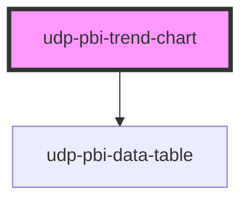

# udp-pbi-trend-chart

<!-- Auto Generated Below -->

## Overview

Line / area trend (light mockup "Performance trend", dark mockup "Service requests"): one dominant
series, a quieter dashed comparison, a soft grid, no axis titles. The line draws once; hover or the
arrow keys move a crosshair with a high-contrast tooltip (principle 29). A click (or Enter) on a
period reports it as `dataPointClick`.

## Properties

| Property           | Attribute            | Description                                                                                                                                                                                  | Type                                               | Default           |
| ------------------ | -------------------- | -------------------------------------------------------------------------------------------------------------------------------------------------------------------------------------------- | -------------------------------------------------- | ----------------- |
| `area`             | `area`               | Shade the primary series down to zero in its own hue (principle 15).                                                                                                                         | `boolean`                                          | `true`            |
| `calc`             | `calc`               | Curtain: how it is calculated, one line.                                                                                                                                                     | `string \| undefined`                              | `undefined`       |
| `categories`       | --                   | X categories in order (months, weeks…).                                                                                                                                                      | `string[]`                                         | `[]`              |
| `categoryTooltips` | --                   | Extra measures per period for the tooltip, aligned with `categories`.                                                                                                                        | `TooltipItem[][]`                                  | `[]`              |
| `chartHeight`      | `chart-height`       | Plot height in px.                                                                                                                                                                           | `number`                                           | `260`             |
| `crossFilterField` | `cross-filter-field` | Column reference a click filters, e.g. 'Date'[Month].                                                                                                                                        | `string \| undefined`                              | `undefined`       |
| `directLabels`     | `direct-labels`      | Label each series at its last point instead of relying on a legend (principle 28).                                                                                                           | `boolean`                                          | `true`            |
| `emptyMessage`     | `empty-message`      |                                                                                                                                                                                              | `string \| undefined`                              | `undefined`       |
| `error`            | `error`              |                                                                                                                                                                                              | `string \| undefined`                              | `undefined`       |
| `exportFileName`   | `export-file-name`   |                                                                                                                                                                                              | `string \| undefined`                              | `undefined`       |
| `exportFormats`    | --                   |                                                                                                                                                                                              | `ExportFormat[]`                                   | `['csv', 'xlsx']` |
| `exportRows`       | --                   | Raw query rows to export instead of the visual's table.                                                                                                                                      | `TableRow[] \| undefined`                          | `undefined`       |
| `exportable`       | `exportable`         |                                                                                                                                                                                              | `boolean`                                          | `true`            |
| `focusable`        | `focusable`          |                                                                                                                                                                                              | `boolean`                                          | `true`            |
| `format`           | --                   |                                                                                                                                                                                              | `FormatSpec \| undefined`                          | `undefined`       |
| `frame`            | `frame`              | card: the Univerus template card (header, toolbar, curtain, focus view). none: the visual alone, to compose inside a host card (UDP: udp-fluent-card); states and events are unchanged.      | `"card" \| "none"`                                 | `'card'`          |
| `gap`              | `gap`                | Shade the gap between the primary series and the comparison instead of the area (FT surplus / deficit): favourable stretches in the ok tone, unfavourable ones in the bad tone (`goodWhen`). | `boolean`                                          | `false`           |
| `goodWhen`         | `good-when`          | gap: whether the primary series being above the comparison is favourable (higher) or not (lower).                                                                                            | `"higher" \| "lower"`                              | `'higher'`        |
| `heading`          | `heading`            | Card title (`title` is a global HTML attribute, hence `heading`).                                                                                                                            | `string`                                           | `''`              |
| `index`            | `index`              | Entrance stagger position.                                                                                                                                                                   | `number`                                           | `0`               |
| `info`             | `info`               | Curtain: what the chart means, one sentence.                                                                                                                                                 | `string \| undefined`                              | `undefined`       |
| `interactive`      | `interactive`        | A click on a period emits `dataPointClick` (default: when `crossFilterField` is set).                                                                                                        | `boolean \| undefined`                             | `undefined`       |
| `label`            | `label`              | Accessible name of the chart; defaults to the heading.                                                                                                                                       | `string \| undefined`                              | `undefined`       |
| `loading`          | `loading`            |                                                                                                                                                                                              | `boolean`                                          | `false`           |
| `loadingRows`      | `loading-rows`       |                                                                                                                                                                                              | `number`                                           | `5`               |
| `referenceLines`   | --                   | Targets, averages or thresholds across the plot (labelled at the start of the line).                                                                                                         | `ReferenceLineSpec[]`                              | `[]`              |
| `selectedValue`    | `selected-value`     | The selected period (a value of `categories`), marked with a band.                                                                                                                           | `boolean \| null \| number \| string \| undefined` | `undefined`       |
| `series`           | --                   | Exactly one primary series and at most one comparison (principle 14).                                                                                                                        | `TrendSeries[]`                                    | `[]`              |
| `stale`            | `stale`              | Previous filters' data shown (dimmed) while the new query runs.                                                                                                                              | `boolean`                                          | `false`           |
| `subheading`       | `subheading`         |                                                                                                                                                                                              | `string \| undefined`                              | `undefined`       |
| `tableToggle`      | `table-toggle`       |                                                                                                                                                                                              | `boolean`                                          | `true`            |
| `testIdPrefix`     | `test-id-prefix`     |                                                                                                                                                                                              | `string \| undefined`                              | `undefined`       |
| `theme`            | `theme`              | Pins this element to a template regardless of <html data-theme>.                                                                                                                             | `"neoglass" \| "nocturne" \| undefined`            | `undefined`       |
| `visualId`         | `visual-id`          | Identifies the visual in its events.                                                                                                                                                         | `string \| undefined`                              | `undefined`       |

## Events

| Event             | Description | Type                                |
| ----------------- | ----------- | ----------------------------------- |
| `dataPointClick`  |             | `CustomEvent<DataPointClickDetail>` |
| `exportData`      |             | `CustomEvent<ExportDetail>`         |
| `focusModeChange` |             | `CustomEvent<FocusModeDetail>`      |
| `viewChange`      |             | `CustomEvent<ViewChangeDetail>`     |

## Dependencies

### Depends on

- [udp-pbi-data-table](../../tables/udp-pbi-data-table)

### Graph

----------------------------------------------

*Generated by Stencil from the component source. Do not edit by hand.*
