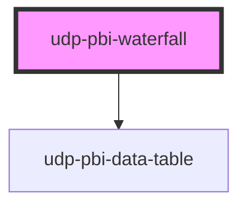

# udp-pbi-waterfall

<!-- Auto Generated Below -->

## Overview

Waterfall (IBCS bridge; FT "flow"): how a level becomes another — the opening level, the
movements and the closing level (with optional subtotals). Levels are solid in the actual colour
from zero; movements float from the running level, coloured by business meaning (`goodWhen`)
and labelled with their sign; thin connectors carry the running level from step to step.
Vertical by default, horizontal for long step names. Hover or ← → show the tooltip; a click
(Enter / Space) reports the step.

## Properties

| Property           | Attribute            | Description                                                                                                                                                                                | Type                                               | Default           |
| ------------------ | -------------------- | ------------------------------------------------------------------------------------------------------------------------------------------------------------------------------------------ | -------------------------------------------------- | ----------------- |
| `baseline`         | `baseline`           | zero: bars from zero (the default). auto: the axis starts near the lowest level when movements are small against the levels; the level bars are then cut with a break mark (IBCS scaling). | `"auto" \| "zero"`                                 | `'zero'`          |
| `calc`             | `calc`               | Curtain: how it is calculated, one line.                                                                                                                                                   | `string \| undefined`                              | `undefined`       |
| `categoryLabel`    | `category-label`     | Header of the step column in the table view and the export.                                                                                                                                | `string`                                           | `'Step'`          |
| `chartHeight`      | `chart-height`       | Plot height in px (vertical).                                                                                                                                                              | `number`                                           | `280`             |
| `crossFilterField` | `cross-filter-field` | Column reference a click on a step filters.                                                                                                                                                | `string \| undefined`                              | `undefined`       |
| `emptyMessage`     | `empty-message`      |                                                                                                                                                                                            | `string \| undefined`                              | `undefined`       |
| `error`            | `error`              |                                                                                                                                                                                            | `string \| undefined`                              | `undefined`       |
| `exportFileName`   | `export-file-name`   |                                                                                                                                                                                            | `string \| undefined`                              | `undefined`       |
| `exportFormats`    | --                   |                                                                                                                                                                                            | `ExportFormat[]`                                   | `['csv', 'xlsx']` |
| `exportRows`       | --                   | Raw query rows to export instead of the visual's table.                                                                                                                                    | `TableRow[] \| undefined`                          | `undefined`       |
| `exportable`       | `exportable`         |                                                                                                                                                                                            | `boolean`                                          | `true`            |
| `focusable`        | `focusable`          |                                                                                                                                                                                            | `boolean`                                          | `true`            |
| `format`           | --                   |                                                                                                                                                                                            | `FormatSpec \| undefined`                          | `undefined`       |
| `frame`            | `frame`              | card: the Univerus template card (header, toolbar, curtain, focus view). none: the visual alone, to compose inside a host card (UDP: udp-fluent-card); states and events are unchanged.    | `"card" \| "none"`                                 | `'card'`          |
| `goodWhen`         | `good-when`          | Which way a movement is favourable (a backlog is better lower).                                                                                                                            | `"higher" \| "lower"`                              | `'higher'`        |
| `heading`          | `heading`            | Card title (`title` is a global HTML attribute, hence `heading`).                                                                                                                          | `string`                                           | `''`              |
| `index`            | `index`              | Entrance stagger position.                                                                                                                                                                 | `number`                                           | `0`               |
| `info`             | `info`               | Curtain: what the chart means, one sentence.                                                                                                                                               | `string \| undefined`                              | `undefined`       |
| `interactive`      | `interactive`        | A click emits `dataPointClick` (default: when `crossFilterField` is set).                                                                                                                  | `boolean \| undefined`                             | `undefined`       |
| `label`            | `label`              | Accessible name of the chart; defaults to the heading.                                                                                                                                     | `string \| undefined`                              | `undefined`       |
| `labels`           | `labels`             | auto: values on the bars where they fit; none: tooltip and table only.                                                                                                                     | `"auto" \| "none"`                                 | `'auto'`          |
| `loading`          | `loading`            |                                                                                                                                                                                            | `boolean`                                          | `false`           |
| `loadingRows`      | `loading-rows`       |                                                                                                                                                                                            | `number`                                           | `5`               |
| `orientation`      | `orientation`        |                                                                                                                                                                                            | `"horizontal" \| "vertical"`                       | `'vertical'`      |
| `selectedValue`    | `selected-value`     | The selected step (raw value or id): the others dim.                                                                                                                                       | `boolean \| null \| number \| string \| undefined` | `undefined`       |
| `stale`            | `stale`              | Previous filters' data shown (dimmed) while the new query runs.                                                                                                                            | `boolean`                                          | `false`           |
| `steps`            | --                   | The bridge, in order: levels (start, subtotal, end) and movements (delta).                                                                                                                 | `WaterfallStep[]`                                  | `[]`              |
| `subheading`       | `subheading`         |                                                                                                                                                                                            | `string \| undefined`                              | `undefined`       |
| `tableToggle`      | `table-toggle`       |                                                                                                                                                                                            | `boolean`                                          | `true`            |
| `testIdPrefix`     | `test-id-prefix`     |                                                                                                                                                                                            | `string \| undefined`                              | `undefined`       |
| `theme`            | `theme`              | Pins this element to a template regardless of <html data-theme>.                                                                                                                           | `"neoglass" \| "nocturne" \| undefined`            | `undefined`       |
| `visualId`         | `visual-id`          | Identifies the visual in its events.                                                                                                                                                       | `string \| undefined`                              | `undefined`       |

## Events

| Event             | Description | Type                                |
| ----------------- | ----------- | ----------------------------------- |
| `dataPointClick`  |             | `CustomEvent<DataPointClickDetail>` |
| `exportData`      |             | `CustomEvent<ExportDetail>`         |
| `focusModeChange` |             | `CustomEvent<FocusModeDetail>`      |
| `viewChange`      |             | `CustomEvent<ViewChangeDetail>`     |

## Dependencies

### Depends on

- [udp-pbi-data-table](../../tables/udp-pbi-data-table)

### Graph

----------------------------------------------

*Generated by Stencil from the component source. Do not edit by hand.*
