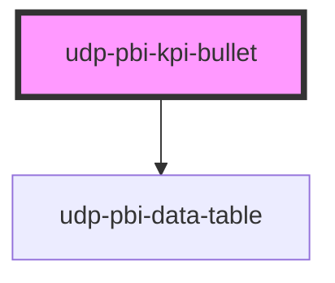

# udp-pbi-kpi-bullet

<!-- Auto Generated Below -->

## Overview

KPI against a target as a bullet graph (Stephen Few): qualitative bands (poor / fair / good from
`thresholds`), the value as a bar, the target as a tick, an optional forecast marker, and a status
chip saying how far from the target it is. The readable replacement for a gauge.

## Properties

| Property           | Attribute            | Description                                                                                 | Type                                    | Default           |
| ------------------ | -------------------- | ------------------------------------------------------------------------------------------- | --------------------------------------- | ----------------- |
| `active`           | `active`             |                                                                                             | `boolean \| undefined`                  | `undefined`       |
| `calc`             | `calc`               |                                                                                             | `string \| undefined`                   | `undefined`       |
| `caption`          | `caption`            |                                                                                             | `string \| undefined`                   | `undefined`       |
| `crossFilterField` | `cross-filter-field` |                                                                                             | `string \| undefined`                   | `undefined`       |
| `displayValue`     | `display-value`      |                                                                                             | `string \| undefined`                   | `undefined`       |
| `error`            | `error`              |                                                                                             | `string \| undefined`                   | `undefined`       |
| `exportFileName`   | `export-file-name`   |                                                                                             | `string \| undefined`                   | `undefined`       |
| `exportFormats`    | --                   |                                                                                             | `ExportFormat[]`                        | `['csv', 'xlsx']` |
| `exportRows`       | --                   |                                                                                             | `TableRow[] \| undefined`               | `undefined`       |
| `exportable`       | `exportable`         |                                                                                             | `boolean`                               | `true`            |
| `focusable`        | `focusable`          |                                                                                             | `boolean`                               | `true`            |
| `forecast`         | `forecast`           | A projected value (end of period), drawn as a hollow marker.                                | `null \| number \| undefined`           | `undefined`       |
| `forecastLabel`    | `forecast-label`     |                                                                                             | `string`                                | `'Forecast'`      |
| `format`           | --                   | Format of the value, the target, the thresholds and the scale.                              | `FormatSpec \| undefined`               | `undefined`       |
| `goodWhen`         | `good-when`          |                                                                                             | `"higher" \| "lower"`                   | `'higher'`        |
| `heading`          | `heading`            | The KPI label.                                                                              | `string`                                | `''`              |
| `icon`             | `icon`               |                                                                                             | `string \| undefined`                   | `undefined`       |
| `index`            | `index`              |                                                                                             | `number`                                | `0`               |
| `info`             | `info`               |                                                                                             | `string \| undefined`                   | `undefined`       |
| `interactive`      | `interactive`        |                                                                                             | `boolean \| undefined`                  | `undefined`       |
| `loading`          | `loading`            |                                                                                             | `boolean`                               | `false`           |
| `max`              | `max`                | Scale end (default: a nice value above everything drawn).                                   | `null \| number \| undefined`           | `undefined`       |
| `stale`            | `stale`              |                                                                                             | `boolean`                               | `false`           |
| `statusLabels`     | --                   | Status chip texts (default: "On target" / "Close to target" / "Off target", with the gap).  | `KpiStatusLabels`                       | `{}`              |
| `target`           | `target`             |                                                                                             | `null \| number \| undefined`           | `undefined`       |
| `targetLabel`      | `target-label`       |                                                                                             | `string`                                | `'Target'`        |
| `theme`            | `theme`              |                                                                                             | `"neoglass" \| "nocturne" \| undefined` | `undefined`       |
| `thresholds`       | --                   | Band limits, ascending: two give poor / fair / good (the order flips when lower is better). | `number[]`                              | `[]`              |
| `value`            | `value`              |                                                                                             | `null \| number \| undefined`           | `undefined`       |
| `visualId`         | `visual-id`          | Identifies the visual in its events.                                                        | `string \| undefined`                   | `undefined`       |

## Events

| Event             | Description | Type                                |
| ----------------- | ----------- | ----------------------------------- |
| `dataPointClick`  |             | `CustomEvent<DataPointClickDetail>` |
| `exportData`      |             | `CustomEvent<ExportDetail>`         |
| `focusModeChange` |             | `CustomEvent<FocusModeDetail>`      |
| `viewChange`      |             | `CustomEvent<ViewChangeDetail>`     |

## Dependencies

### Depends on

- [udp-pbi-data-table](../../tables/udp-pbi-data-table)

### Graph

----------------------------------------------

*Generated by Stencil from the component source. Do not edit by hand.*
