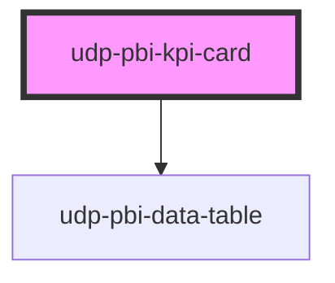

# udp-pbi-kpi-card

<!-- Auto Generated Below -->

## Overview

KPI card (Lens `kpi_card`): uppercase label, tinted icon mark, the number as the dominant element,
a delta / badge / meter. "What it means / how it is calculated" lives one hover (or keyboard focus)
away in the curtain (principle 35), never on the card face.

The card is a frame holding sibling buttons, never nested ones: the content (a full-card button
when the KPI is interactive), on touch screens an ⓘ that toggles the same curtain, and the ⋯ menu
(export, focus view). Test ids: `kpi-<label-slug>` on the number, `kpi-card-<label-slug>` on the card.

## Properties

| Property           | Attribute            | Description                                                                                             | Type                                    | Default           |
| ------------------ | -------------------- | ------------------------------------------------------------------------------------------------------- | --------------------------------------- | ----------------- |
| `active`           | `active`             | Toggle state; leave undefined for a plain action (no pressed state, no selection ring).                 | `boolean \| undefined`                  | `undefined`       |
| `badge`            | --                   | Status chip beside the number.                                                                          | `KpiBadge \| undefined`                 | `undefined`       |
| `calc`             | `calc`               | Curtain: how it is calculated, one line.                                                                | `string \| undefined`                   | `undefined`       |
| `caption`          | `caption`            | Quiet words beside the number, e.g. "in register", "Years".                                             | `string \| undefined`                   | `undefined`       |
| `comparisonValue`  | `comparison-value`   | Reference value (PY, plan…) the delta is computed against.                                              | `null \| number \| undefined`           | `undefined`       |
| `crossFilterField` | `cross-filter-field` | Column reference a click filters (reported in `dataPointClick`).                                        | `string \| undefined`                   | `undefined`       |
| `delta`            | --                   | Explicit delta; otherwise it is derived from `comparison-value`.                                        | `KpiDelta \| undefined`                 | `undefined`       |
| `deltaLabel`       | `delta-label`        | Suffix of the derived delta, e.g. "vs PY".                                                              | `string \| undefined`                   | `undefined`       |
| `displayValue`     | `display-value`      | Already formatted text; wins over `value` (e.g. "2.4h").                                                | `string \| undefined`                   | `undefined`       |
| `error`            | `error`              | Shows "—"; the message goes to the number's tooltip.                                                    | `string \| undefined`                   | `undefined`       |
| `exportFileName`   | `export-file-name`   |                                                                                                         | `string \| undefined`                   | `undefined`       |
| `exportFormats`    | --                   |                                                                                                         | `ExportFormat[]`                        | `['csv', 'xlsx']` |
| `exportRows`       | --                   | Raw query rows to export instead of the KPI's own table.                                                | `TableRow[] \| undefined`               | `undefined`       |
| `exportable`       | `exportable`         |                                                                                                         | `boolean`                               | `true`            |
| `focusable`        | `focusable`          |                                                                                                         | `boolean`                               | `true`            |
| `format`           | --                   | Format of `value` (and of the comparison).                                                              | `FormatSpec \| undefined`               | `undefined`       |
| `goodWhen`         | `good-when`          | Whether a higher value is favourable (colours the derived delta).                                       | `"higher" \| "lower"`                   | `'higher'`        |
| `heading`          | `heading`            | The KPI label (`title` is a global HTML attribute, hence `heading`).                                    | `string`                                | `''`              |
| `icon`             | `icon`               | Icon mark by name (`database`, `check-circle`, `alert-triangle`, …); or use the `icon` slot.            | `string \| undefined`                   | `undefined`       |
| `index`            | `index`              | Entrance stagger position.                                                                              | `number`                                | `0`               |
| `info`             | `info`               | Curtain: what the number means, one sentence.                                                           | `string \| undefined`                   | `undefined`       |
| `interactive`      | `interactive`        | The card is a button that emits `dataPointClick` (default: when `active` or `crossFilterField` is set). | `boolean \| undefined`                  | `undefined`       |
| `loading`          | `loading`            | Shows "…" until the first value arrives.                                                                | `boolean`                               | `false`           |
| `meter`            | --                   | Thin meter under the number (0..1) with its percentage.                                                 | `KpiMeter \| undefined`                 | `undefined`       |
| `stale`            | `stale`              | Previous filters' value shown (dimmed) while the new query runs.                                        | `boolean`                               | `false`           |
| `theme`            | `theme`              | Pins this element to a template regardless of <html data-theme>.                                        | `"neoglass" \| "nocturne" \| undefined` | `undefined`       |
| `value`            | `value`              | The number.                                                                                             | `null \| number \| undefined`           | `undefined`       |
| `visualId`         | `visual-id`          | Identifies the visual in its events.                                                                    | `string \| undefined`                   | `undefined`       |

## Events

| Event             | Description | Type                                |
| ----------------- | ----------- | ----------------------------------- |
| `dataPointClick`  |             | `CustomEvent<DataPointClickDetail>` |
| `exportData`      |             | `CustomEvent<ExportDetail>`         |
| `focusModeChange` |             | `CustomEvent<FocusModeDetail>`      |
| `viewChange`      |             | `CustomEvent<ViewChangeDetail>`     |

## Slots

| Slot       | Description |
| ---------- | ----------- |
| `"aside"`  |             |
| `"footer"` |             |

## Dependencies

### Depends on

- [udp-pbi-data-table](../../tables/udp-pbi-data-table)

### Graph

----------------------------------------------

*Generated by Stencil from the component source. Do not edit by hand.*
