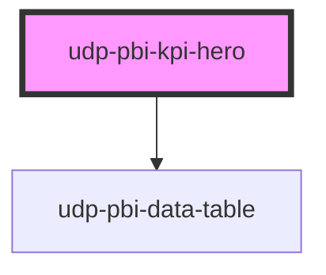

# udp-pbi-kpi-hero

<!-- Auto Generated Below -->

## Overview

Hero KPI (Lens `kpi_hero`, dark mockup "SLA compliance"): one dominant number, up to four
supporting metrics and a 60-tick meter that wipes in once. Use it when one headline metric
deserves the most space on the page (principle 7). Hover or focus drops the curtain.

## Properties

| Property          | Attribute          | Description                                                               | Type                                                  | Default           |
| ----------------- | ------------------ | ------------------------------------------------------------------------- | ----------------------------------------------------- | ----------------- |
| `calc`            | `calc`             | Curtain: how it is calculated, one line.                                  | `string \| undefined`                                 | `undefined`       |
| `comparisonValue` | `comparison-value` |                                                                           | `null \| number \| undefined`                         | `undefined`       |
| `delta`           | --                 | Explicit delta; otherwise derived from `comparison-value`.                | `undefined \| { text: string; favourable: boolean; }` | `undefined`       |
| `deltaLabel`      | `delta-label`      | Suffix of the derived delta, e.g. "vs August".                            | `string \| undefined`                                 | `undefined`       |
| `displayValue`    | `display-value`    | Already formatted text; wins over `value`.                                | `string \| undefined`                                 | `undefined`       |
| `error`           | `error`            |                                                                           | `string \| undefined`                                 | `undefined`       |
| `exportFileName`  | `export-file-name` |                                                                           | `string \| undefined`                                 | `undefined`       |
| `exportFormats`   | --                 |                                                                           | `ExportFormat[]`                                      | `['csv', 'xlsx']` |
| `exportRows`      | --                 | Raw query rows to export instead of the hero's own table.                 | `TableRow[] \| undefined`                             | `undefined`       |
| `exportable`      | `exportable`       |                                                                           | `boolean`                                             | `true`            |
| `focusable`       | `focusable`        |                                                                           | `boolean`                                             | `true`            |
| `format`          | --                 | Format of `value` (and of the comparison).                                | `FormatSpec \| undefined`                             | `undefined`       |
| `goodWhen`        | `good-when`        |                                                                           | `"higher" \| "lower"`                                 | `'higher'`        |
| `heading`         | `heading`          | The headline label (`title` is a global HTML attribute, hence `heading`). | `string`                                              | `''`              |
| `index`           | `index`            | Entrance stagger position.                                                | `number`                                              | `0`               |
| `info`            | `info`             | Curtain: what the number means, one sentence.                             | `string \| undefined`                                 | `undefined`       |
| `loading`         | `loading`          |                                                                           | `boolean`                                             | `false`           |
| `meter`           | --                 | Optional 60-tick utilisation meter.                                       | `HeroMeter \| undefined`                              | `undefined`       |
| `metrics`         | --                 | Up to four supporting metrics.                                            | `HeroMetric[]`                                        | `[]`              |
| `stale`           | `stale`            | Previous filters' value shown (dimmed) while the new query runs.          | `boolean`                                             | `false`           |
| `theme`           | `theme`            | Pins this element to a template regardless of <html data-theme>.          | `"neoglass" \| "nocturne" \| undefined`               | `undefined`       |
| `unit`            | `unit`             | Small unit after the number, e.g. "%".                                    | `string \| undefined`                                 | `undefined`       |
| `value`           | `value`            | The headline number.                                                      | `null \| number \| undefined`                         | `undefined`       |
| `visualId`        | `visual-id`        | Identifies the visual in its events.                                      | `string \| undefined`                                 | `undefined`       |

## Events

| Event             | Description | Type                                |
| ----------------- | ----------- | ----------------------------------- |
| `dataPointClick`  |             | `CustomEvent<DataPointClickDetail>` |
| `exportData`      |             | `CustomEvent<ExportDetail>`         |
| `focusModeChange` |             | `CustomEvent<FocusModeDetail>`      |
| `viewChange`      |             | `CustomEvent<ViewChangeDetail>`     |

## Dependencies

### Depends on

- [udp-pbi-data-table](../../tables/udp-pbi-data-table)

### Graph

----------------------------------------------

*Generated by Stencil from the component source. Do not edit by hand.*
