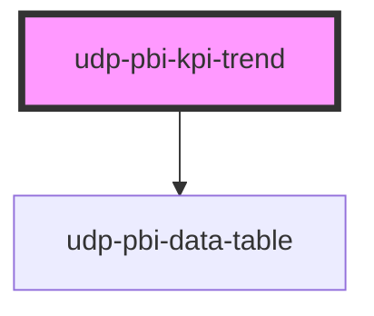

# udp-pbi-kpi-trend

<!-- Auto Generated Below -->

## Overview

KPI with its recent trend: the number, its delta and a sparkline of the last periods with the
current one marked, the lowest and highest points and an optional target line. Answers "how much,
and which way is it going?". Without `value` the latest period is the headline; without a
comparison the delta is against the previous period. Hovering the line reads any period.

## Properties

| Property           | Attribute            | Description                                                                              | Type                                    | Default           |
| ------------------ | -------------------- | ---------------------------------------------------------------------------------------- | --------------------------------------- | ----------------- |
| `active`           | `active`             | Toggle state; leave undefined for a plain action.                                        | `boolean \| undefined`                  | `undefined`       |
| `calc`             | `calc`               | Curtain: how it is calculated, one line.                                                 | `string \| undefined`                   | `undefined`       |
| `caption`          | `caption`            | Quiet words beside the number.                                                           | `string \| undefined`                   | `undefined`       |
| `comparisonValue`  | `comparison-value`   |                                                                                          | `null \| number \| undefined`           | `undefined`       |
| `crossFilterField` | `cross-filter-field` |                                                                                          | `string \| undefined`                   | `undefined`       |
| `delta`            | --                   | Explicit delta; otherwise derived from `comparisonValue` (default: the previous period). | `KpiDelta \| undefined`                 | `undefined`       |
| `deltaLabel`       | `delta-label`        | Suffix of the derived delta (default: "vs <previous period>").                           | `string \| undefined`                   | `undefined`       |
| `displayValue`     | `display-value`      | Ready text for the number; wins over `value`.                                            | `string \| undefined`                   | `undefined`       |
| `error`            | `error`              |                                                                                          | `string \| undefined`                   | `undefined`       |
| `exportFileName`   | `export-file-name`   |                                                                                          | `string \| undefined`                   | `undefined`       |
| `exportFormats`    | --                   |                                                                                          | `ExportFormat[]`                        | `['csv', 'xlsx']` |
| `exportRows`       | --                   |                                                                                          | `TableRow[] \| undefined`               | `undefined`       |
| `exportable`       | `exportable`         |                                                                                          | `boolean`                               | `true`            |
| `focusable`        | `focusable`          |                                                                                          | `boolean`                               | `true`            |
| `format`           | --                   | Format of the number, the series and the target.                                         | `FormatSpec \| undefined`               | `undefined`       |
| `goodWhen`         | `good-when`          |                                                                                          | `"higher" \| "lower"`                   | `'higher'`        |
| `heading`          | `heading`            | The KPI label.                                                                           | `string`                                | `''`              |
| `icon`             | `icon`               | Icon mark by name, or the `icon` slot.                                                   | `string \| undefined`                   | `undefined`       |
| `index`            | `index`              |                                                                                          | `number`                                | `0`               |
| `info`             | `info`               | Curtain: what the number means, one sentence.                                            | `string \| undefined`                   | `undefined`       |
| `interactive`      | `interactive`        |                                                                                          | `boolean \| undefined`                  | `undefined`       |
| `loading`          | `loading`            |                                                                                          | `boolean`                               | `false`           |
| `periodLabel`      | `period-label`       | What the line covers, e.g. "Last 12 months".                                             | `string \| undefined`                   | `undefined`       |
| `series`           | --                   | The recent periods, oldest first.                                                        | `KpiPoint[]`                            | `[]`              |
| `stale`            | `stale`              |                                                                                          | `boolean`                               | `false`           |
| `target`           | `target`             | A target drawn as a dashed line.                                                         | `null \| number \| undefined`           | `undefined`       |
| `targetLabel`      | `target-label`       |                                                                                          | `string`                                | `'Target'`        |
| `theme`            | `theme`              |                                                                                          | `"neoglass" \| "nocturne" \| undefined` | `undefined`       |
| `value`            | `value`              | The headline number (default: the latest period's value).                                | `null \| number \| undefined`           | `undefined`       |
| `visualId`         | `visual-id`          | Identifies the visual in its events.                                                     | `string \| undefined`                   | `undefined`       |

## Events

| Event             | Description | Type                                |
| ----------------- | ----------- | ----------------------------------- |
| `dataPointClick`  |             | `CustomEvent<DataPointClickDetail>` |
| `exportData`      |             | `CustomEvent<ExportDetail>`         |
| `focusModeChange` |             | `CustomEvent<FocusModeDetail>`      |
| `viewChange`      |             | `CustomEvent<ViewChangeDetail>`     |

## Dependencies

### Depends on

- [udp-pbi-data-table](../../tables/udp-pbi-data-table)

### Graph

----------------------------------------------

*Generated by Stencil from the component source. Do not edit by hand.*
