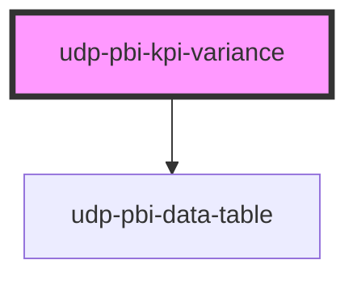

# udp-pbi-kpi-variance

<!-- Auto Generated Below -->

## Overview

IBCS variance KPI: the actual (AC) against one scenario (PY, PL, FC or BU) in IBCS notation —
the AC bar solid, the scenario bar in its notation (PY grey, PL outlined, FC hatched-dashed,
BU dotted), the absolute variance as a green / red bar and the relative variance as a pin.
Answers "better or worse than plan / last year, and by how much?".

## Properties

| Property           | Attribute            | Description                                                     | Type                                    | Default           |
| ------------------ | -------------------- | --------------------------------------------------------------- | --------------------------------------- | ----------------- |
| `active`           | `active`             |                                                                 | `boolean \| undefined`                  | `undefined`       |
| `actual`           | `actual`             | The actual (AC).                                                | `null \| number \| undefined`           | `undefined`       |
| `actualLabel`      | `actual-label`       |                                                                 | `string`                                | `'AC'`            |
| `calc`             | `calc`               |                                                                 | `string \| undefined`                   | `undefined`       |
| `caption`          | `caption`            |                                                                 | `string \| undefined`                   | `undefined`       |
| `comparison`       | `comparison`         | The scenario value (prior year, plan, forecast or budget).      | `null \| number \| undefined`           | `undefined`       |
| `comparisonLabel`  | `comparison-label`   | Name of the scenario row (default: the scenario code).          | `string \| undefined`                   | `undefined`       |
| `crossFilterField` | `cross-filter-field` |                                                                 | `string \| undefined`                   | `undefined`       |
| `decimals`         | `decimals`           | Decimals of the relative variance.                              | `number`                                | `1`               |
| `displayValue`     | `display-value`      | Ready text for the headline; wins over `actual`.                | `string \| undefined`                   | `undefined`       |
| `error`            | `error`              |                                                                 | `string \| undefined`                   | `undefined`       |
| `exportFileName`   | `export-file-name`   |                                                                 | `string \| undefined`                   | `undefined`       |
| `exportFormats`    | --                   |                                                                 | `ExportFormat[]`                        | `['csv', 'xlsx']` |
| `exportRows`       | --                   |                                                                 | `TableRow[] \| undefined`               | `undefined`       |
| `exportable`       | `exportable`         |                                                                 | `boolean`                               | `true`            |
| `focusable`        | `focusable`          |                                                                 | `boolean`                               | `true`            |
| `format`           | --                   | Format of the actual, the comparison and the absolute variance. | `FormatSpec \| undefined`               | `undefined`       |
| `goodWhen`         | `good-when`          | Whether a higher actual is favourable (colours the variances).  | `"higher" \| "lower"`                   | `'higher'`        |
| `heading`          | `heading`            | The KPI label.                                                  | `string`                                | `''`              |
| `icon`             | `icon`               |                                                                 | `string \| undefined`                   | `undefined`       |
| `index`            | `index`              |                                                                 | `number`                                | `0`               |
| `info`             | `info`               |                                                                 | `string \| undefined`                   | `undefined`       |
| `interactive`      | `interactive`        |                                                                 | `boolean \| undefined`                  | `undefined`       |
| `loading`          | `loading`            |                                                                 | `boolean`                               | `false`           |
| `scenario`         | `scenario`           |                                                                 | `"BU" \| "FC" \| "PL" \| "PY"`          | `'PY'`            |
| `stale`            | `stale`              |                                                                 | `boolean`                               | `false`           |
| `theme`            | `theme`              |                                                                 | `"neoglass" \| "nocturne" \| undefined` | `undefined`       |
| `visualId`         | `visual-id`          | Identifies the visual in its events.                            | `string \| undefined`                   | `undefined`       |

## Events

| Event             | Description | Type                                |
| ----------------- | ----------- | ----------------------------------- |
| `dataPointClick`  |             | `CustomEvent<DataPointClickDetail>` |
| `exportData`      |             | `CustomEvent<ExportDetail>`         |
| `focusModeChange` |             | `CustomEvent<FocusModeDetail>`      |
| `viewChange`      |             | `CustomEvent<ViewChangeDetail>`     |

## Dependencies

### Depends on

- [udp-pbi-data-table](../../tables/udp-pbi-data-table)

### Graph

----------------------------------------------

*Generated by Stencil from the component source. Do not edit by hand.*
