# udp-pbi-data-table

<!-- Auto Generated Below -->

## Overview

"Which exact rows?" — precision over pattern (principle 19). Sortable headers (`aria-sort`),
10 / 25 / 50-row pages, and below a 520 px container each row becomes a two-line list.
Rows are selectable (`aria-selected`, Enter / Space) and report the click as `dataPointClick`.

Also the table view of every other visual (`frame="none"`: no card, no toolbar).

## Properties

| Property           | Attribute            | Description                                                                                                                                                                             | Type                                               | Default           |
| ------------------ | -------------------- | --------------------------------------------------------------------------------------------------------------------------------------------------------------------------------------- | -------------------------------------------------- | ----------------- |
| `calc`             | `calc`               | Curtain: how it is calculated, one line.                                                                                                                                                | `string \| undefined`                              | `undefined`       |
| `columns`          | --                   | Columns; inferred from the rows when empty.                                                                                                                                             | `TableColumn[]`                                    | `[]`              |
| `crossFilterField` | `cross-filter-field` | Column reference a row click filters, e.g. 'asset_class'[Asset_Class].                                                                                                                  | `string \| undefined`                              | `undefined`       |
| `emptyMessage`     | `empty-message`      |                                                                                                                                                                                         | `string \| undefined`                              | `undefined`       |
| `error`            | `error`              |                                                                                                                                                                                         | `string \| undefined`                              | `undefined`       |
| `exportFileName`   | `export-file-name`   |                                                                                                                                                                                         | `string \| undefined`                              | `undefined`       |
| `exportFormats`    | --                   |                                                                                                                                                                                         | `ExportFormat[]`                                   | `['csv', 'xlsx']` |
| `exportRows`       | --                   | Raw query rows to export instead of the table shown.                                                                                                                                    | `TableRow[] \| undefined`                          | `undefined`       |
| `exportable`       | `exportable`         |                                                                                                                                                                                         | `boolean`                                          | `true`            |
| `focusable`        | `focusable`          |                                                                                                                                                                                         | `boolean`                                          | `true`            |
| `format`           | --                   | Default format of numeric columns without their own.                                                                                                                                    | `FormatSpec \| undefined`                          | `undefined`       |
| `frame`            | `frame`              | card: the Univerus template card (header, toolbar, curtain, focus view). none: the visual alone, to compose inside a host card (UDP: udp-fluent-card); states and events are unchanged. | `"card" \| "none"`                                 | `'card'`          |
| `heading`          | `heading`            | Card title (`title` is a global HTML attribute, hence `heading`).                                                                                                                       | `string`                                           | `''`              |
| `index`            | `index`              | Entrance stagger position.                                                                                                                                                              | `number`                                           | `0`               |
| `info`             | `info`               | Curtain: what the data means, one sentence.                                                                                                                                             | `string \| undefined`                              | `undefined`       |
| `interactive`      | `interactive`        | Rows are selectable and emit `dataPointClick` (default: when `crossFilterField` is set).                                                                                                | `boolean \| undefined`                             | `undefined`       |
| `label`            | `label`              | Accessible name of the table; defaults to the heading.                                                                                                                                  | `string \| undefined`                              | `undefined`       |
| `loading`          | `loading`            |                                                                                                                                                                                         | `boolean`                                          | `false`           |
| `loadingRows`      | `loading-rows`       |                                                                                                                                                                                         | `number`                                           | `5`               |
| `maxHeight`        | `max-height`         | Max height of the scroll area in px (sticky header); none by default.                                                                                                                   | `number \| undefined`                              | `undefined`       |
| `pageSize`         | `page-size`          |                                                                                                                                                                                         | `number`                                           | `10`              |
| `paginated`        | `paginated`          |                                                                                                                                                                                         | `boolean`                                          | `true`            |
| `rowKey`           | `row-key`            | Field identifying a row (selection, click value). Default: the first column.                                                                                                            | `string \| undefined`                              | `undefined`       |
| `rows`             | --                   |                                                                                                                                                                                         | `TableRow[]`                                       | `[]`              |
| `selectedValue`    | `selected-value`     | Selected row (its `rowKey` value).                                                                                                                                                      | `boolean \| null \| number \| string \| undefined` | `undefined`       |
| `sortable`         | `sortable`           |                                                                                                                                                                                         | `boolean`                                          | `true`            |
| `stale`            | `stale`              | Previous filters' rows shown (dimmed) while new ones load.                                                                                                                              | `boolean`                                          | `false`           |
| `subheading`       | `subheading`         |                                                                                                                                                                                         | `string \| undefined`                              | `undefined`       |
| `testIdPrefix`     | `test-id-prefix`     | `data-testid` prefix: `${prefix}-row-${key}` on each row.                                                                                                                               | `string \| undefined`                              | `undefined`       |
| `theme`            | `theme`              | Pins this element to a template regardless of <html data-theme>.                                                                                                                        | `"neoglass" \| "nocturne" \| undefined`            | `undefined`       |
| `visualId`         | `visual-id`          | Identifies the visual in its events.                                                                                                                                                    | `string \| undefined`                              | `undefined`       |

## Events

| Event             | Description | Type                                |
| ----------------- | ----------- | ----------------------------------- |
| `dataPointClick`  |             | `CustomEvent<DataPointClickDetail>` |
| `exportData`      |             | `CustomEvent<ExportDetail>`         |
| `focusModeChange` |             | `CustomEvent<FocusModeDetail>`      |
| `viewChange`      |             | `CustomEvent<ViewChangeDetail>`     |

## Dependencies

### Used by

 - [udp-pbi-boxplot](../../charts/udp-pbi-boxplot)
 - [udp-pbi-bullet-bars](../../charts/udp-pbi-bullet-bars)
 - [udp-pbi-calendar-heatmap](../../charts/udp-pbi-calendar-heatmap)
 - [udp-pbi-column-chart](../../charts/udp-pbi-column-chart)
 - [udp-pbi-diverging-bars](../../charts/udp-pbi-diverging-bars)
 - [udp-pbi-donut](../../charts/udp-pbi-donut)
 - [udp-pbi-dot-plot](../../charts/udp-pbi-dot-plot)
 - [udp-pbi-ibcs-variance](../../charts/udp-pbi-ibcs-variance)
 - [udp-pbi-kpi-card](../../kpi/udp-pbi-kpi-card)
 - [udp-pbi-kpi-hero](../../kpi/udp-pbi-kpi-hero)
 - [udp-pbi-ranking-bars](../../charts/udp-pbi-ranking-bars)
 - [udp-pbi-scatter](../../charts/udp-pbi-scatter)
 - [udp-pbi-spotlight-bars](../../charts/udp-pbi-spotlight-bars)
 - [udp-pbi-stacked-bars](../../charts/udp-pbi-stacked-bars)
 - [udp-pbi-timeline](../../charts/udp-pbi-timeline)
 - [udp-pbi-treemap](../../charts/udp-pbi-treemap)
 - [udp-pbi-trend-chart](../../charts/udp-pbi-trend-chart)
 - [udp-pbi-waterfall](../../charts/udp-pbi-waterfall)

### Graph

```mermaid
graph TD;
  udp-pbi-boxplot --> udp-pbi-data-table
  udp-pbi-bullet-bars --> udp-pbi-data-table
  udp-pbi-calendar-heatmap --> udp-pbi-data-table
  udp-pbi-column-chart --> udp-pbi-data-table
  udp-pbi-diverging-bars --> udp-pbi-data-table
  udp-pbi-donut --> udp-pbi-data-table
  udp-pbi-dot-plot --> udp-pbi-data-table
  udp-pbi-ibcs-variance --> udp-pbi-data-table
  udp-pbi-kpi-card --> udp-pbi-data-table
  udp-pbi-kpi-hero --> udp-pbi-data-table
  udp-pbi-ranking-bars --> udp-pbi-data-table
  udp-pbi-scatter --> udp-pbi-data-table
  udp-pbi-spotlight-bars --> udp-pbi-data-table
  udp-pbi-stacked-bars --> udp-pbi-data-table
  udp-pbi-timeline --> udp-pbi-data-table
  udp-pbi-treemap --> udp-pbi-data-table
  udp-pbi-trend-chart --> udp-pbi-data-table
  udp-pbi-waterfall --> udp-pbi-data-table
  style udp-pbi-data-table fill:#f9f,stroke:#333,stroke-width:4px
```

----------------------------------------------

*Generated by Stencil from the component source. Do not edit by hand.*
